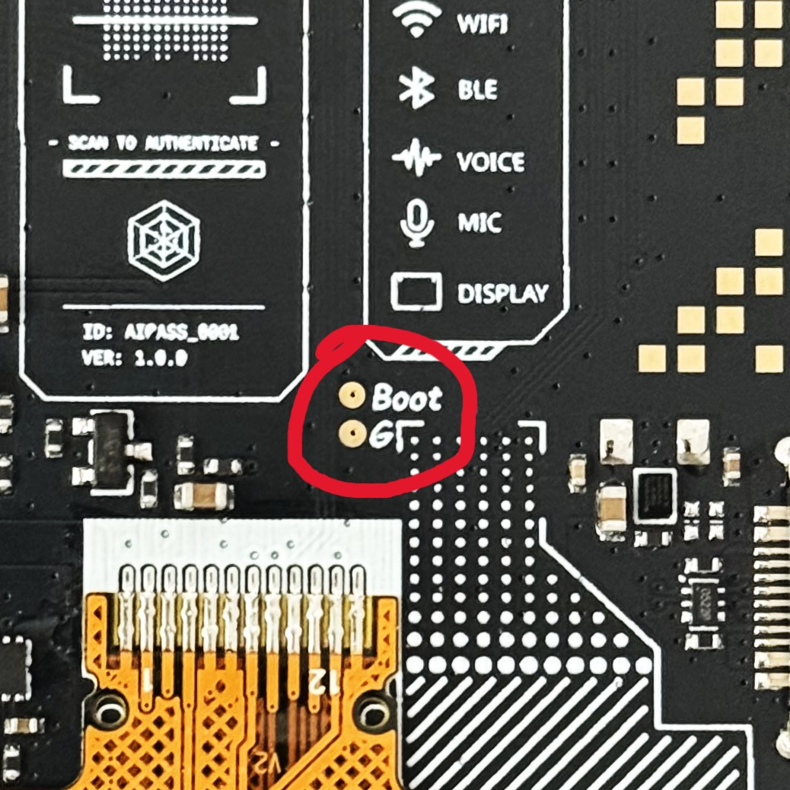

# FoloToy AI Passport：GPIO18/19 被改用后的 USB 救援指南

**实机记录、整理与上传：[Arrow36](https://github.com/Arrow36)** · 2026-10-02

适用于本次遇到的情况：给 **ESP32-C3、8 MB Flash 的 FoloToy AI Passport** 刷入了把 GPIO18/19 改成 UART/GPIO 的固件，正常开机后 USB 失联；短接 Boot/G 后设备重新出现，但网页刷机和 esptool 仍然 `Write timeout`。

本次恢复成功的路径是：

```text
Boot 与 G 在上电时短接，阻止问题固件正常启动
    ↓
Windows 重新识别 ESP32-C3 USB 复合设备
    ↓
为 JTAG Interface 2 正确安装 WinUSB 驱动
    ↓
乐鑫版 OpenOCD 通过原生 USB JTAG 写入兼容的真机固件
    ↓
Verify OK → 移除短接 → 重新开机 → 检查屏幕和 USB
```

**最容易错过的一点：出现 COM 口不代表 ROM 下载握手已经可用；看到驱动名称是 WinUSB，也不代表 OpenOCD 一定能打开 JTAG 接口。** 本次真正解决问题的是修复 Interface 2 的驱动绑定，再走 JTAG 刷写。

> **数据影响：本文的 `full.bin → 0x0` 是完整镜像恢复方案，可能覆盖原有账户、密钥、设置和设备身份数据。需要保留数据时，先取得匹配的分区表、组件镜像和可用的数据备份，再制定分段刷写方案；不要直接照抄完整镜像命令。本文不要求、也不包含整片擦除。**

## 1. 先判断是否是同一类问题

| 现象 | 应如何理解 |
| --- | --- |
| 刷过测试固件后，正常开机立即提示“设备描述符请求失败”或代码 43 | 检查固件是否占用了 GPIO18/19；代码 43 本身不能证明原因 |
| Boot/G 短接上电后出现 `303A:1001` 和 COM 口 | USB 已重新枚举，但还没有证明能刷机 |
| esptool/网页停在 `Connecting...`，最终 `Write timeout` | 串口下载链路没有正常响应；本案例改用 USB JTAG 恢复 |
| OpenOCD 报 `LIBUSB_ERROR_NOT_FOUND` | 优先检查 JTAG Interface 2 的 WinUSB 绑定，不要直接判断芯片损坏 |
| 只是在自动休眠后 USB 消失 | 先唤醒或重启设备；深度休眠也会关闭 USB，不一定需要救援 |

ESP32-C3 的 GPIO18 是 USB D−、GPIO19 是 USB D+。乐鑫明确说明，改用这两个引脚或禁用 USB Serial/JTAG 会导致设备消失；深度休眠也会断开 USB。[USB Serial/JTAG 官方说明](https://docs.espressif.com/projects/esp-idf/en/v5.5.3/esp32c3/api-guides/usb-serial-jtag-console.html)

本指南的成功依据是 Arrow36 提供的实机恢复记录，不是对所有板卡、芯片修订版和故障原因的保证。原记录中 GPIO2、启动模式等结论的核实边界见 [案例记录与技术说明](docs/case-notes.md)。

## 2. 准备工具与正确固件

- Windows 电脑、支持数据传输的 USB-C 线、能准确连接 Boot/G 两点的工具。
- **乐鑫维护的 OpenOCD**：[官方发布页](https://github.com/espressif/openocd-esp32/releases)。使用 Windows 对应包；安装过 ESP-IDF 的电脑通常已自带。不要用缺少 ESP32 支持的普通 OpenOCD 替代。
- **Zadig**：[官方下载](https://zadig.akeo.ie/)。本次记录使用 2.9；如果现有 JTAG 驱动已能正常工作，可跳过驱动替换。
- **适配 AI Passport 真机的完整固件**：ESP32-C3、8 MB Flash，并由提供方确认包含 bootloader、分区表和应用、烧写地址为 `0x0`。文件名带 `full` 并不能单独证明格式正确。

本次记录使用的是“牛来互动播放器”的完整镜像，可从 [FoloToy 官方下载入口](https://ai-passport.folotoy.cn/api/download/official/niulai-interactive-player) 获取。2026-10-02 核对时，该接口返回 `folo-ai-passport-niulai-v0.0.2-full.bin`；接口内容以后可能更新。下文将已下载并核对的文件另存为 `C:\AI-Passport-Rescue\niulai-full.bin` 作为示例。

也可通过 [FoloToy 官方刷机工具](https://ai-passport.folotoy.cn/tools/web-flasher/) 了解兼容玩法。这里安装的是可运行的官方玩法，**不等于自动恢复每台设备的出厂专属身份**。

**不要再次使用为模拟器编译、将 GPIO18/19 改为 UART 的镜像。** 本仓库不附带固件二进制或驱动安装包。

## 3. Boot/G 短接上电，让 USB 重新出现

1. 拔掉 USB，长按独立电源键约 2 秒关机。处理裸露主板时避开电池、排线和其他元件；本流程通常不需要拔电池。
2. 找到主板中部偏右、橙色屏幕排线上方、带明确丝印的两个圆形触点：上方 **`Boot`**、下方 **`G`**。请以自己板子的丝印为准。

   

   红圈标出需要连通的两个圆形触点：上方 `Boot`（GPIO9 / 启动触点），下方 `G`（GND）。只短接这两个触点。

3. 仅连通这两个触点，保持接触稳定，再插入电脑 USB，按独立电源键开机。案例照片从主板背面看，电源键位于右侧，丝印为 `SW4`。
4. 检查设备管理器是否出现 `USB JTAG/serial debug unit`，以及 VID/PID 为 **`303A:1001`** 的设备。COM 编号可能不是 COM4，黑屏也可能是正常引导状态。
5. 关闭网页刷机工具、串口监视器和其他 OpenOCD 实例，只保留要恢复的这一台 ESP32 设备。若复位会让错误固件再次启动，保持 Boot/G 稳定短接至刷写校验结束，再移除。

**不要把主板上的方形金色图案当成 GPIO 测试点，也不要往这些位置接 3.3 V。** 案例记录中多组方形焊盘实测与 GND 相连。这里只使用明确标注的 Boot/G，不需要给 GPIO2 飞线。

## 4. 修复 JTAG Interface 2 的驱动

如果 OpenOCD 已能发现芯片，可以直接进入下一节；否则按本次成功记录操作：

1. 运行 Zadig，根据 Windows 提示授予安装驱动所需的管理员权限。
2. 选择 **Options → List All Devices**。
3. 选中 **`USB JTAG/serial debug unit (Interface 2)`**。
4. 核对 USB ID 为 **`303A 1001 02`**；设备实例的接口部分通常为 `MI_02`。
5. 目标驱动选择 **WinUSB**，点击 `Install Driver` / `Replace Driver`；本次记录中的按钮也可能显示 `Downgrade WCID Driver`。安装成功后关闭 Zadig。

> **只处理 Interface 2。不要替换 Interface 0 的 USB 串口驱动，也不要选整个 USB Composite Device、键盘、鼠标等其他设备。** 若不确定选中了哪一项，先核对接口编号再操作。

本次记录显示 Zadig 提供的 WinUSB 标签为 `v6.1.7600.16385`，这不是要求所有 Windows 都降级到某个系统驱动版本。应以接口匹配、安装成功和 OpenOCD 实际连接结果为准。

也可以按 [乐鑫官方 JTAG 驱动说明](https://docs.espressif.com/projects/esp-idf/en/v5.5.3/esp32c3/api-guides/jtag-debugging/configure-builtin-jtag.html)，安装 ESP-IDF 工具中的 **Espressif - WinUSB support for JTAG (ESP32-C3/S3)**。[Zadig 使用说明](https://github.com/pbatard/libwdi/wiki/Zadig)

## 5. 先确认 JTAG 能连接，再执行刷写

下面都是 **PowerShell** 命令。把 OpenOCD 路径改成你实际解压的位置；`-s` 必须指向同一套工具的 `share/openocd/scripts` 目录。路径前的 `&` 和行尾反引号不能省略。

### 5.1 检查连接，不写 Flash

```powershell
& 'C:\Tools\openocd-esp32\bin\openocd.exe' `
  -s 'C:\Tools\openocd-esp32\share\openocd\scripts' `
  -f 'board/esp32c3-builtin.cfg' `
  -c 'init; targets; shutdown'

if ($LASTEXITCODE -ne 0) { throw 'JTAG 连接未通过，请先检查驱动与设备状态。' }
```

这一步会连接调试接口，但不执行 Flash 写入。确认日志能找到 `esp_usb_jtag: Device found`、ESP32-C3 的 TAP 和 RISC-V 核心；具体措辞可能随工具版本不同。仍有 libusb 错误时，先解决连接问题，不要继续刷写。

### 5.2 写入完整镜像并校验

**仅在接受本页开头说明的数据覆盖影响、且固件与目标板匹配时执行。** 以下命令会实际写 Flash：

```powershell
& 'C:\Tools\openocd-esp32\bin\openocd.exe' `
  -s 'C:\Tools\openocd-esp32\share\openocd\scripts' `
  -f 'board/esp32c3-builtin.cfg' `
  -c 'program_esp {C:/AI-Passport-Rescue/niulai-full.bin} 0x0 verify reset exit'

if ($LASTEXITCODE -ne 0) { throw '刷写或校验失败，请保留错误日志。' }
```

- `0x0`：此处是经确认的**完整合并镜像**的起始地址；单独应用 `.bin` 不能按这个地址刷。
- `verify`：写完后校验；`reset`：请求重启；`exit`：退出 OpenOCD。
- 固件路径在 OpenOCD 命令内使用 `/`，外加 `{}` 处理路径中的空格。
- 这条路径通过 **USB JTAG** 工作，不使用 `COM4`，也不需要外接 JTAG 仿真器。

命令格式依据：[乐鑫 OpenOCD 刷写说明](https://docs.espressif.com/projects/esp-idf/en/v5.5.3/esp32c3/api-guides/jtag-debugging/index.html#upload-application-for-debugging)。

### 5.3 判断是否真正恢复

先确认命令正常退出，日志中出现：

```text
** Programming Finished ... **
** Verify OK **
```

然后移除 Boot/G 短接，拔掉 USB，正常关机再开机，重新连接 USB。若使用其他独立电源，也要确保进行了一次正常重新上电。不要仅凭拔插 USB 推断带电池的设备已完全断电。

分别确认：

- 屏幕能够启动新固件，按键可响应。
- Windows 中 USB 设备正常，原来的描述符错误不再出现。
- 串口或官方网页工具可以正常连接；验证连接即可，不必为了验证再刷一次。

`Verify OK` 证明的是写入内容校验通过，屏幕、按键和 USB 恢复仍需上述实机检查。案例成功日志摘录见 [reported-success.txt](logs/reported-success.txt)。

## 常见卡点

| 卡点 | 优先检查 |
| --- | --- |
| 完全没有 USB 设备 | 电源键是否真正开机、数据线、USB 口、Boot/G 是否在上电前接通 |
| COM 口出现但一直 `Write timeout` | 先排除占用；不要无限重复 esptool，本案例使用 JTAG 路径解决 |
| `LIBUSB_ERROR_NOT_FOUND` | Interface 2 是否安装了能被 libusb 使用的 WinUSB 驱动 |
| 驱动显示 WinUSB 仍报错 | 重新核对 `303A 1001 02` 与驱动绑定，以 OpenOCD 检查结果为准 |
| `Can't find board/esp32c3-builtin.cfg` | `-s` 路径是否正确；是否拿到了完整的乐鑫 OpenOCD 包 |
| 找不到 `program_esp` 或 `esp_usb_jtag` | 是否误用了普通 OpenOCD，或混用了另一版本的 scripts |
| TAP 全 0 / 全 1、无法识别核心 | 电源、USB 连接、目标型号、短接状态；有新证据后再重试 |
| 校验成功后仍黑屏 | 短接是否移除，是否真正重新开机，固件是否为该板真机版本 |
| 保留旧账户是硬性要求 | 暂停完整镜像刷写；核实分区和镜像写入范围，改用经过验证的保留数据方案 |

## 后续开发怎样避免再次发生

- 真机固件保留 GPIO18/19 给 USB；使用 USB 控制台时选择 `CONFIG_ESP_CONSOLE_USB_SERIAL_JTAG=y`。
- 模拟器与真机使用独立构建配置、独立输出目录和明确文件名，不把模拟器镜像当成真机固件。
- 发布说明写明目标芯片、Flash 容量、镜像类型、烧写偏移和数据影响，附文件哈希便于核对。
- 保留 bootloader、分区表、应用、ELF 和构建配置，后续才能定位问题并评估分段恢复。
- 睡眠功能单独验证 USB 断开与唤醒后的重连行为；不要把正常休眠误判成驱动损坏。

本仓库提供的是一次成功案例的可复现步骤。更深层的启动原因、未验证的假设和资料来源，见 [案例记录与技术说明](docs/case-notes.md)。
